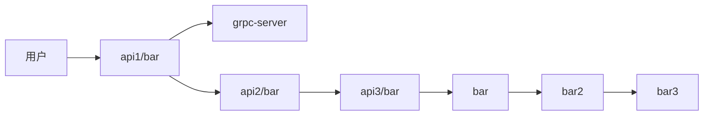

## 服务链路关系
#### 关系图
<!-- 调用架构图 -->

#### 关系说明:
1. 用户  请求 api1(echo server) 服务的 api1/bar
2. api1 调用 Grpc 服务
2. api1 调用 api2 (gin server) 服务的 api2/bar
3. api2 调用 api3 (echo server )服务的 api3/bar
4. api3 调用 内部 调用方法 bar->bar2->bar3
## 普通运行
#### 安装jaeger
1. 下载jaeger,我使用的是 jaeger-all-in-one
2. 启动 jaeger ~/tool/jaeger-1.31.0-linux-amd64/jaeger-all-in-one
3. 默认查看面板 地址 http://localhost:16686/
4. tracer Batcher的地址,下面代码会体现: http://localhost:14268/api/traces

#### 启动服务
1. 示例文件:moda_tracing下 有四个目录,分别是 api1_http,api2_http,api3_http,grpc 分别对应三个api服务 一个grpc服务 
2. 分别启动三个服务,进入目录 go run ./ -c ./conf.toml 即可启动服务

## docker 运行
进入moda_tracing目录,执行 make deploy 
会同时启动 jaeger,api1,api2,api3,grpc 服务,并且能互通

## 查看jaeger链路
   
1. 调用api1: curl localhost:8081/api1/bar
2. 等待调用成功
3. 打开 jaeger 面板,查看链路关系图,http://localhost:16686/

