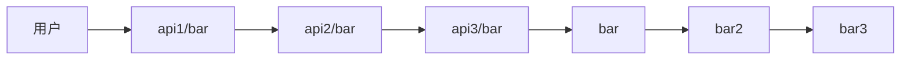
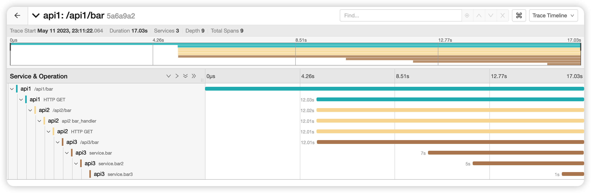

## 服务链路关系
#### 关系图
<!-- 调用架构图 -->


#### 关系说明:
1. 用户  请求 api1(echo server) 服务的 api1/bar
2. api1 调用 api2 (gin server) 服务的 api2/bar
3. api2 调用 api3 (echo server )服务的 api3/bar
4. api3 调用 内部 调用方法 bar->bar2->bar3

## 安装jaeger
1. 下载jaeger,我使用的是 jaeger-all-in-one
2. 启动 jaeger ~/tool/jaeger-1.31.0-linux-amd64/jaeger-all-in-one
3. 默认查看面板 地址 http://localhost:16686/
4. tracer Batcher的地址,下面代码会体现: http://localhost:14268/api/traces

## 初始化 全局的 OpenTelemetry
这里openTelemetry 的exporter 为 jaeger 为例,其他的exporter 可以参考官方文档
```go
var tracer = otel.Tracer("go-moda")
func InitJaegerProvider(jaegerUrl string, serviceName string) (func(ctx context.Context) error, error) {
	if jaegerUrl == "" {
		logger.Errorw("jaeger url is empty")
		return nil, nil
	}
	tracer = otel.Tracer(serviceName)
	exp, err := jaeger.New(jaeger.WithCollectorEndpoint(jaeger.WithEndpoint(jaegerUrl)))
	if err != nil {
		return nil, err
	}
	tp := tracesdk.NewTracerProvider(
		tracesdk.WithBatcher(exp),
		tracesdk.WithResource(resource.NewSchemaless(
			semconv.ServiceNameKey.String(serviceName),
		)),
	)
	otel.SetTracerProvider(tp)
	// otel.SetTextMapPropagator(propagation.TraceContext{})
	b3Propagator := b3.New(b3.WithInjectEncoding(b3.B3MultipleHeader))
	propagator := propagation.NewCompositeTextMapPropagator(propagation.TraceContext{}, propagation.Baggage{}, b3Propagator)
	otel.SetTextMapPropagator(propagator)
	return tp.Shutdown, nil
}
```
#### 说明
1. 上面方法的参数 jaegerUrl 是 jaeger 的地址,如果安装的是 jaeger-all-in-one,则地址默认为 http://localhost:14268/api/traces
2. serviceName 是服务名称,这里我使用的是 api1,api2,api3
3. 增加 span 可以使用 tracer.Start(ctx, "spanName") 

## 启动 http服务
上面初始化了全局的 OpenTelemetry后,在当前服务就可以使用 OpenTelemetry 的 tracer 进行链路追踪了  
但如果 需要跨服务进行调用,比如http server之间的调用,需要: 
1. 对于 http client: httpclient 请求server的时候,将ctx(上下文) 注入到 req header 中
2. 对于 http server: 在获取http请求时,解析req header 中的 parent trace 这样就可以在服务传输中获取到上下文,从而进行链路追踪
### 启动 http服务开启链路追踪
上面说的服务传输过程中, echo 和 gin 都有成熟的的中间件来实现了,我们在初始化的时候,将中间件加入到服务中即可 
下面是 echo 和 gin启动服务的演示:
#### echo server 示例
···go
import "go.opentelemetry.io/contrib/instrumentation/github.com/labstack/echo/otelecho"
e := echo.New()
e.Server.Use(otelecho.Middleware("moda"))
#### gin 举例
```go
import "go.opentelemetry.io/contrib/instrumentation/github.com/gin-gonic/gin/otelgin"
ginEngine := gin.Default()
g.GetServer().Use(otelgin.Middleware("my-server"))
```
### http client 调用服务开启链路追踪
上面说到 httpserver 启动时 通过解析 req header 中的 parent trace 来进行链路追踪 
那么在调用服务时,就需要将上下文注入到 req header 中,以下是封装的 httpclient:
```go
package tracing

import (
	"bytes"
	"context"
	"encoding/json"
	"io"
	"io/ioutil"
	"net/http"

	"go.opentelemetry.io/contrib/instrumentation/net/http/otelhttp"
)

// 新增 options  http.Transport
type ClientOption struct {
	Transport *http.Transport
}

type ClientOptionFunc func(*ClientOption)

func WithClientTransport(transport *http.Transport) ClientOptionFunc {
	return func(option *ClientOption) {
		option.Transport = transport
	}
}

// CallAPI 为 http client 封装,默认使用 otelhttp.NewTransport(http.DefaultTransport)
func CallAPI(ctx context.Context, url string, method string, reqBody interface{}, option ...ClientOptionFunc) ([]byte, error) {
	clientOption := &ClientOption{}
	for _, o := range option {
		o(clientOption)
	}

	client := http.Client{Transport: otelhttp.NewTransport(http.DefaultTransport)}
	if clientOption.Transport != nil {
		client.Transport = otelhttp.NewTransport(clientOption.Transport)
	}
	var requestBody io.Reader
	if reqBody != nil {
		payload, err := json.Marshal(reqBody)
		if err != nil {
			return nil, err
		}
		requestBody = bytes.NewReader(payload)
	}
	req, err := http.NewRequestWithContext(ctx, method, url, requestBody)
	if err != nil {
		return nil, err
	}
	resp, err := client.Do(req)
	if err != nil {
		return nil, err
	}
	defer resp.Body.Close()
	resBody, err := ioutil.ReadAll(resp.Body)
	if err != nil {
		return nil, err
	}
	return resBody, nil
}

```
#### 说明
1. 上面代码中,使用了 otelhttp.NewTransport(http.DefaultTransport) 将上下文注入到 req header 中
2.  http client 调用服务时,需要将上下文传入到 CallAPI 的 ctx 参数中

## 调用服务,查看链路关系
### 实战代码演示
1. 示例文件:moda_tracing下 有三个目录,分别是 api1_http,api2_http,api_http,分别对应三个服务  
2. 分别启动三个服务,进入目录 go run ./ 即可启动服务,端口分别是 8081,8082,8083
3. 根据上面链路关系,调用api1: curl localhost:8081/api1/bar
4. 等待调用成功
5. 打开 jaeger 面板,查看链路关系图,http://localhost:16686/
6. 后续示例代码启动采用 docker-compose 启动,方便演示
   
### 查看jaeger 



