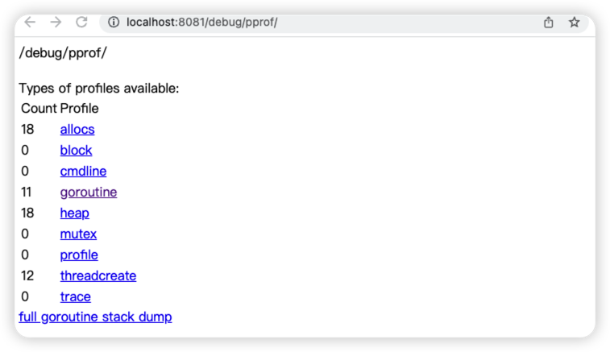
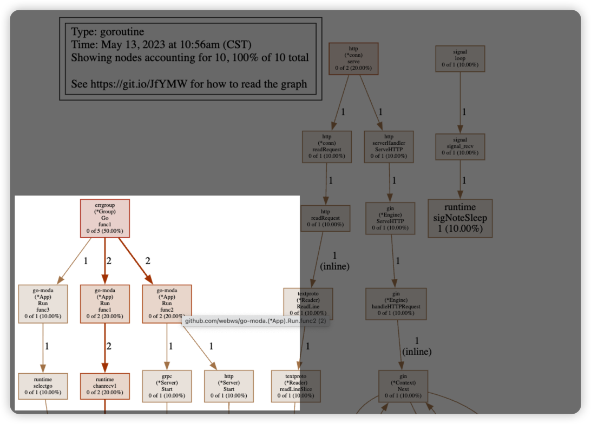
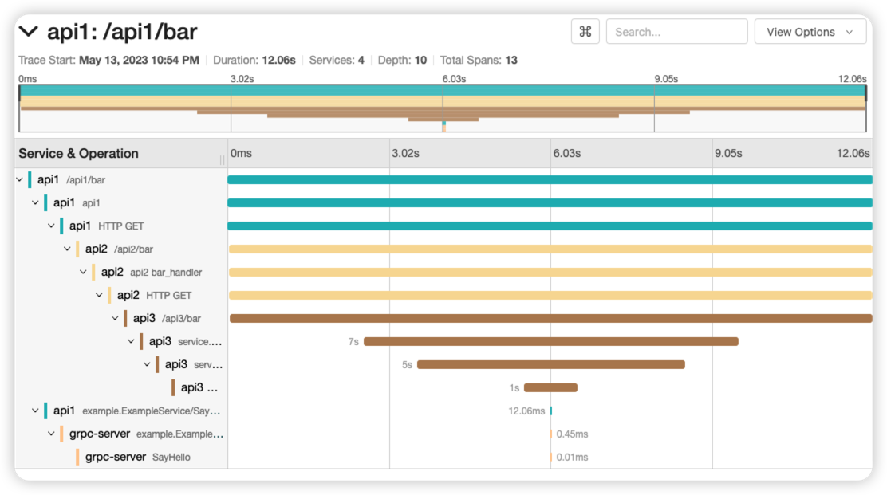

# go-moda
go-moda 是一个基于 Go 语言的通用开发框架
## 特性
- 统一启动入口和优雅退出
- config:    通用的配置文件读取模块，支持 toml、yaml 和 json 格式。
- logger:    日志系统模块，基于 Zap,并支持全局日志和模块日志。
- pprof:	 分析性能
- transport: 集成 http（echo、gin）和 grpc。
- tracing:   openTelemetry 实现微务链路追踪
- Metrics:   指标系统,集成 Prometheus (TODO)
## pprof 性能分析
启动服务默认开启 pprof 性能分析，可以通过 host/debug/pprof/ 查看
  
可视化分析 gouroutine
```shell
go tool pprof http://localhost:8081/debug/pprof/goroutine
(pprof) web
```
可能提示 需要先安装 graphviz, mac 下可以使用 brew 安装
```shell
brew install graphviz
```


## tracing
* moda-go 使用 opentelemetry 实现微服务链路追踪，目前 exporter 支持 jaeger 
* 示例集成了docker 环境,支持 make deploy 同时启动 jaeger,api1,api2,api3,grpc 服务
*  详细示例请看:[tracing_example](./example/tracing/moda_tracing/)


## 示例
基本http/grpc服务启动示例:[basic example](./example/basic/)
gin http 服务示例:[example_gin](./example/ginhttp/)
echo http 服务示例:[example_echo](./example/echohttp/)
grpc 服务示例:[example_grpc](./example/grpc/)
tracing 示例:[tracing_example](./example/tracing/moda_tracing/)
docker 本地CD示例:[docker_example](./example/tracing/moda_tracing/)
## 参考链接
* https://github.com/open-telemetry
* https://github.com/go-kratos
* https://github.com/open-telemetry/opentelemetry-go-contrib
* https://github.com/labstack/echo
* https://github.com/gin-gonic/gin
* https://github.com/uber-go/zap